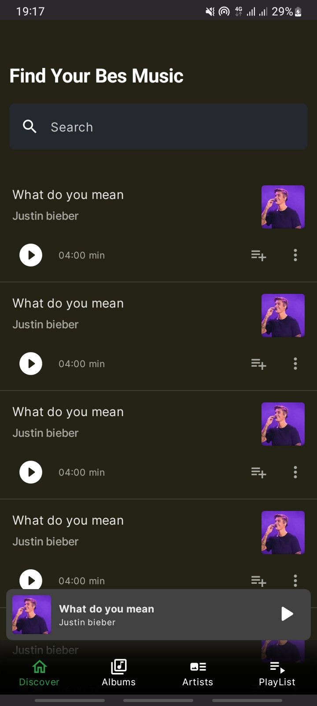

  Playme is a comprehensive music player, not only to listen offline music saved on your Android, but also to stream music for free.. 
 • Multi-Module • Dynamic theming using podcast artwork • Image fetching • [`WindowInsets`](https://developer.android.com/reference/kotlin/android/view/WindowInsets) support • Coroutines • Local storage with Room  **[> Browse](/)**     | |
